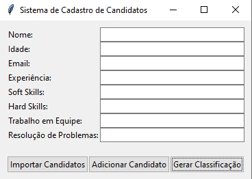
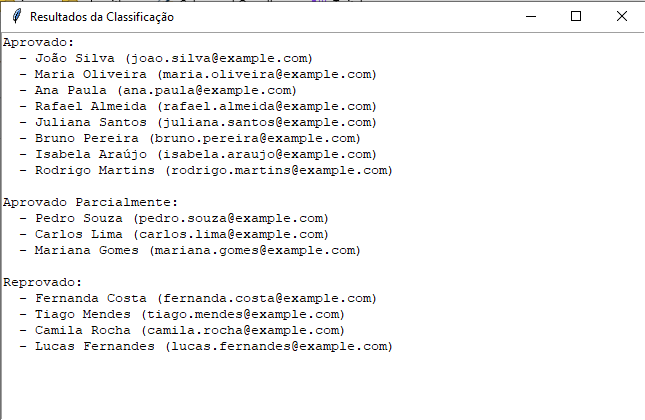

# Candidate Classification System

This repository contains two versions of a candidate classification system developed using the pair programming technique. One version uses ChatGPT, and the other is a **WIP** (Work in Progress) using a different LLM. The project aims to compare the assistance, suggestions, and performance of each model during development, focusing on their use in programming tasks and automated decision-making.

## Features
- Two versions of the system: one using ChatGPT and the other in progress with a different LLM.
- Focus on candidate classification based on multiple criteria.
- Evaluation of LLMs in assisting with programming and decision-making tasks.

## Technologies
- Python
- Tkinter (for the user interface)
- MCDA and ELECTRE TRI (for candidate classification)

## Setup
1. Clone the repository.
2. Install dependencies (if any).
3. Run the system with the provided scripts.

## License
This project is licensed under the MIT License.
